# 개인과제: SPRING PLUS 레거시 코드 리팩토링 플러스

## 과제 소개
- 기존 작성된 레거시 코드를 개선하고, 개발자로서 역량을 넓히고 품질 높은 소프트웨어를 만들어가는 데 기여해보는 실습합니다.
- 실무에서 응용할 수 있는 개념들인 JPA 성능 최적화, QueryDSL을 활용한 동적 쿼리 작성, Spring Security 등을 학습하여 적용합니다.
- AWS의 다양한 서비스를 활용하여, 로컬 환경이 아닌 AWS 서비스에 프로젝트를 관리하고 배포합니다.

## 과제 요구사항

필수 기능

- ### Level. 1
  1. `@Transactional`의 이해: 할 일 저장 기능을 구현한 API(/todos)를 호출할 때, 에러가 발생하고 있어요. 에러가 발생하지 않도록 코드를 수정해주세요.
  2. JWT의 이해
      - User의 정보에 nickname이 필요해졌어요.
        - User 테이블에 nickname 컬럼을 추가해주세요.
        - nickname은 중복 가능합니다.
        - 프론트엔드 개발자가 JWT에서 유저의 닉네임을 꺼내 화면에 보여주길 원하고 있어요.
  3. AOP의 이해: UserAdminController 클래스의 changeUserRole() 메소드가 실행 전 동작하도록 코드를 수정해주세요.
  4. 컨트롤러 테스트의 이해
      - 테스트 패키지 org.example.expert.domain.todo.controller의
        todo_단건_조회_시_todo가_존재하지_않아_예외가_발생한다() 테스트가 실패하고 있어요.
      - 테스트가 정상적으로 수행되어 통과할 수 있도록 테스트 코드를 수정해주세요.
  5. JPA의 이해
      - 할 일 검색 시 weather 조건, 수정일 기준 기간 검색 조건으로도 검색할 수 있어야해요.
      - JPQL을 사용하고, 쿼리 메소드명은 자유롭게 지정하되 너무 길지 않게 해주세요.

- ### Level. 2
  6. JPA Cascade
      - 할 일을 새로 저장할 시, 할 일을 생성한 유저는 담당자로 자동 등록되어야 합니다.
      - JPA의 `cascade` 기능을 활용해 할 일을 생성한 유저가 담당자로 등록될 수 있게 해주세요.
  7. N+1
      - CommentController` 클래스의 `getComments()` API를 호출할 때 N+1 문제가 발생하고 있어요. 해당 문제가 발생하지 않도록 코드를 수정해주세요.
  8. QueryDSL
      - JPQL로 작성된 `findByIdWithUser` 를 QueryDSL로 변경합니다.
      - 7번과 마찬가지로 N+1 문제가 발생하지 않도록 유의해 주세요!
  9. Spring Security
      - 기존 `Filter`와 `Argument Resolver`를 사용하던 코드들을 Spring Security로 변경해주세요.
        - 접근 권한 및 유저 권한 기능은 그대로 유지해주세요.
        - 권한은 Spring Security의 기능을 사용해주세요.
      - 토큰 기반 인증 방식은 유지할 거예요. JWT는 그대로 사용해주세요.

도전 기능

- ### Level. 3
  10. QueryDSL 을 사용하여 검색 기능 만들기
      - 새로운 API로 만들어주세요.
      - 검색 조건은 다음과 같아요.
        - 검색 키워드로 일정의 제목을 검색할 수 있어요.
          - 제목은 부분적으로 일치해도 검색이 가능해요.
        - 일정의 생성일 범위로 검색할 수 있어요.
          - 일정을 생성일 최신순으로 정렬해주세요.
        - 담당자의 닉네임으로도 검색이 가능해요.
          - 닉네임은 부분적으로 일치해도 검색이 가능해요.
      - 다음의 내용을 포함해서 검색 결과를 반환해주세요.
        - 일정에 대한 모든 정보가 아닌, 제목만 넣어주세요.
        - 해당 일정의 담당자 수를 넣어주세요.
        - 해당 일정의 총 댓글 개수를 넣어주세요.
      - 검색 결과는 페이징 처리되어 반환되도록 합니다.
  11. Transaction 심화
      - 매니저 등록 요청을 기록하는 로그 테이블을 만들어주세요.
        - DB 테이블명: `log`
      - 매니저 등록과는 별개로 로그 테이블에는 항상 요청 로그가 남아야 해요.
        - 매니저 등록은 실패할 수 있지만, 로그는 반드시 저장되어야 합니다.
        - 로그 생성 시간은 반드시 필요합니다.
        - 그 외 로그에 들어가는 내용은 원하는 정보를 자유롭게 넣어주세요.
  12. AWS 활용 마스터
      - **공통사항**
        - 각 AWS 서비스의 콘솔에서 내가 만든 서비스들의 설정 화면을 캡쳐하여 `README.md`에 첨부하세요.
      - **12-1. EC2**
        - EC2 인스턴스에서 어플리케이션을 실행하세요.
        - 탄력적 IP를 설정해서 외부에서도 접속할 수 있도록 해주세요.
        - 서버 접속 및 Live 상태를 확인할 수 있는 health check API를 만들고 `README.md` 에 기재하세요.
        - health check API는 누구나 접속 가능해야 해요.
        - API path는 편하게 정해도 괜찮습니다.
      - **12-2. RDS**
        - RDS에 데이터베이스를 구축하고, EC2에서 실행되는 어플리케이션에 연결하세요.
      - **12-3. S3**
        - S3 버킷을 생성하여 유저의 프로필 이미지 업로드 및 관리 API를 구현하세요.
  13. 대용량 데이터 처리
      - 대용량 데이터 처리 실습을 위해, 테스트 코드로 유저 데이터를 100만 건 생성해주세요.
        - 데이터 생성 시 닉네임은 랜덤으로 지정해주세요.
        - 가급적 동일한 닉네임이 들어가지 않도록 방법을 생각해보세요.
      - 닉네임을 조건으로 유저 목록을 검색하는 API를 만들어주세요.
        - 닉네임은 정확히 일치해야 검색이 가능해요.
      - 여러가지 아이디어로 유저 검색 속도를 줄여주세요.
        - 조회 속도를 개선할 수 있는 여러 방법을 고민하고, 각각의 방법들을 실행해보세요.
        - `README.md` 에 각 방법별 실행 결과를 비교할 수 있도록 최초 조회 속도와 개선 과정 별 조회 속도를 확인할 수 있는 표 혹은 이미지를 첨부해주세요.

## AWS 설정 화면
- ### EC2
  - 인스턴스 
    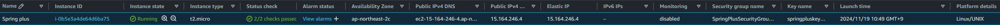
  - 보안 정책 
    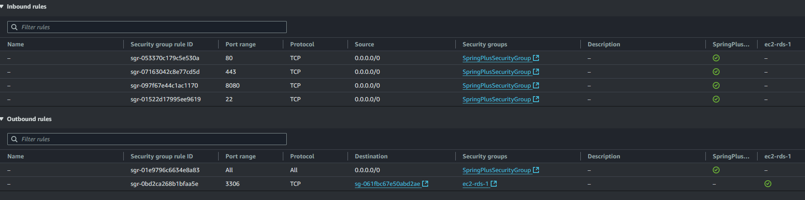
    - 보안 그룹을 지정하여 서비스 간 접근허용을 시켜주었습니다.
  - key pair 
    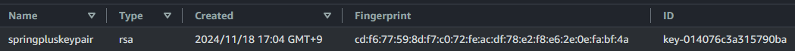
- ### EBS
  - 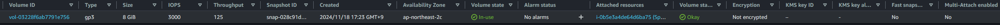
- ### Elastic IP
  - 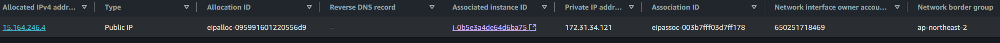
    - private IP address 와 Association ID를 EC2와 연결시켜 주었습니다.
- ### IAM
  - users 
    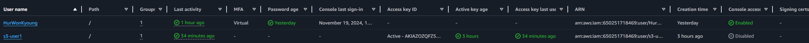
- ### RDS
  - DB 
    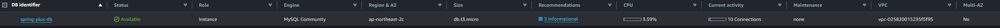
  - 보안 정책 
    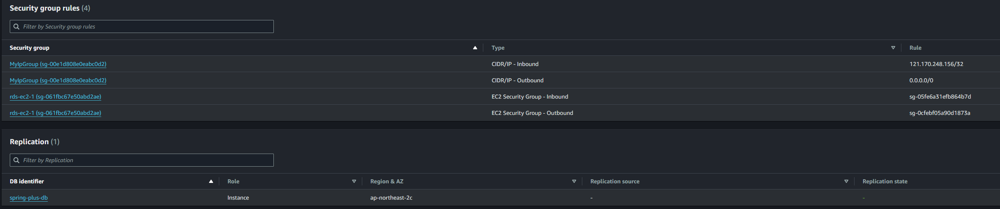
      - 테스트를 확인하기 위해 외부접근을 허용하였습니다. 그리고 내 아이피에 대해서는 3306(Mysql DB port)를 허용해 주었습니다.
      - ec2 인스턴스 보안 그룹을 허용하였고, 그 외 다른 접근은 차단되도록 설정하였습니다.
- ### S3
  - 그룹 권한 
    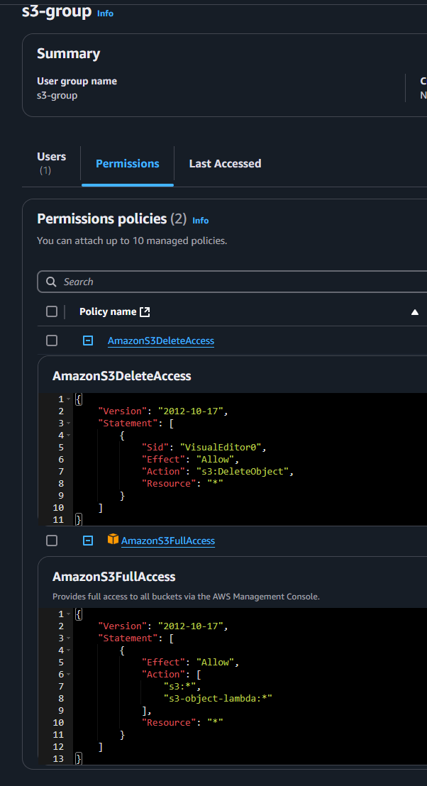
      - 기본적으로 읽기는 모두 허용, 삭제만 따로 추가해주었습니다.
      - 어플리케이션에 들어있는 s3 엑세스,시크릿 키가 혹여라도 유출되더라도 피해를 줄이기 위해 최소화된 권한만 부여하였습니다. 
  - Bucket 
    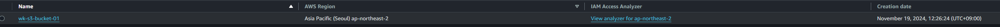

## 대용량 데이터 개선 
- ### 테스트 환경
  - users 테이블에 100만건의 유저 데이터를 넣고, nickname으로 조회 시도하였습니다. 
    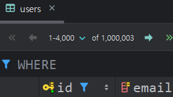
  - 소요시간을 계산하기 위해 `aop.ApiPerformanceAspect.class` 에서 호출 전 시간과 호출 후 시간의 차이를 사용하였습니다.
    
- ### 관계형 데이터베이스 시스템의 Indexing 사용
  - `CREATE INDEX idx_nickname ON users(nickname);` 추가
  - `DESCRIBE users;` 입력해서 테이블에 MUL 적혀있는지 확인  
    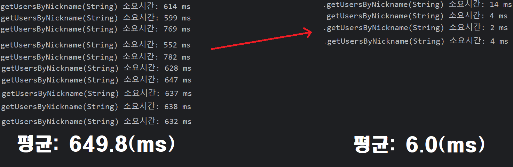

- ### Redis 사용
  - wsl로 redis server 설치 및 서비스 실행
  - app에 redis 설정 적용 하고 어노테이션으로 메서드에 redis 조회 수행되도록 변경 
    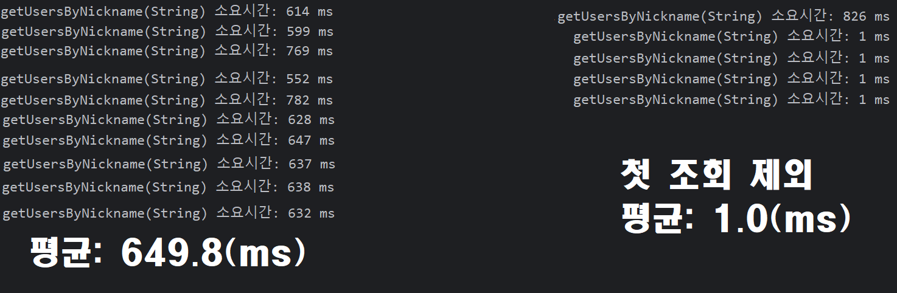

- ### 개선 결과
  - | 방식      | 초기 소요 시간 | 개선 후 소요 시간 | 개선율    |
    |-----------|--------------|-----------------|-----------|
    | 기본 조회  | 649ms        | -               | -         |
    | 인덱스 적용 | 649ms       | 6ms             | 99.08%    |
    | Redis 사용 | 649ms       | 1ms             | 99.85%    |

